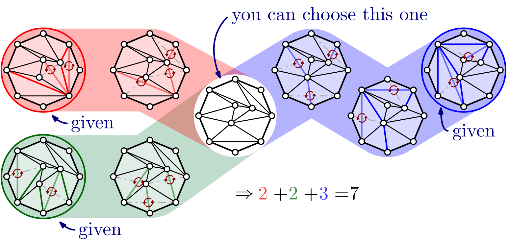

# Computational-Geometry-25

### Table of contents

- [Problem Description](#problem-description)
- [Objective](#objective)
- [Motivation](#motivation)
- [Links](#links)
- [References](#references)

### Algorithm development

- [From reference [3]]([3]Algorithm/math.md)
- [From reference [5]]([5]Algorithm/math.md)

## Problem Description

**Central Triangulation under Parallel Flip Operations**

Given a set of $m$ triangulations $T_1, \dots, T_m$ on the same set $P$ of $n$ points in the plane, this year's challenge problem asks for a central triangulation $C$ on $P$ such that the number of parallel flip operations to reach the $T_i$ from $C$ is minimized. More formally, given $T_1, \dots, T_m$, the goal is to compute $C$ and $m$ sequences of parallel flip operations $F_i$, each transforming $C$ into $T_i$. The objective value $\text{obj}(F_1, \dots, F_m)$ of such a solution is $\sum_{i=1}^{m} |F_i|$, where $|F_i|$ denotes the number of parallel flips in $F_i$.

In a triangulation $T$, a parallel flip is a set $D$ of diagonals of convex quadrilaterals (flippable edges) such that no two $e, e' \in D$ share a triangle. Performing a parallel flip operation transforms $T$ into another triangulation $T'$ by replacing each $e \in D$ by the other diagonal of the convex quadrilateral containing $e$.

## Objective

Find a central triangulation and flip sequences minimizing the total number of parallel flips between your centre and each triangulation in the source set of the instance.

## Motivation
Reconfiguration is the process of changing a structure into another - either through continuous motion or through discrete changes. In Discrete and Computational Geometry, reconfiguration has received particular attention in the context of triangulations, where a parallel flip exchanges one or more (independent) edge(s) of the triangulation for one or more other edge(s), such that the resulting graph is again a triangulation.

## Links

- [CG:SHOP 2026 - Challenge webpage](https://cgshop.ibr.cs.tu-bs.de/competition/cg-shop-2026/#problem-description)

## References

- [[1] Prosenjit Bose and Ferran Hurtado: Flips in planar graphs. Computational Geometry, Volume 42, 2009, pages 60–80](resources/1-s2.0-S0925772108000370-main.pdf)

- [[2] Iyad Kanj and Ge Xia: Flip Distance Is in FPT Time O(n + k · c^k). STACS 2015, pages 500–512.](resources/LIPIcs.STACS.2015.500.pdf)

- [[3] Haohong Li, Ge Xia: An O(3.82^k) Time Algorithm for Convex Flip Distance. Discret. Comput. Geom. 73(3): 702-718 (2025).](resources/2209.13134v2.pdf)

- [[4] David Eppstein: Happy endings for flip graphs. SoCG 2007, pages 92–101.](resources/0610092v2.pdf)

- [[5] Philip Mayer and Petra Mutzel: Engineering A* Search for the Flip Distance of Plane Triangulations. SEA 2024, pages 23:1–23:20.](resources/LIPIcs.SEA.2024.23.pdf)
